# $ Car - Prices - Prediction $

WebApp

•	If you want to view the deployed model App, click here "https://predict--car--price.herokuapp.com/" 

•	If you are searching for Code, Algorithms used and Accuracy of the model Please Open "Car-Price-Prediction.ipynb" file

•	If this repository helped you please give a ⭐ to the repository 

-------------------------------------------------------------------------------------------------------------
# Introduction:

•	India has one of the biggest automobile markets all over the globe every day many buyers usually sell their cars after using for the time to another
buyer, we call them as 2nd /3rd owner etc. 

•	Many platforms such as cars24.com, cardekho.com and OLX.com provides these buyers with a platform where they can sell their used cars, but what should be
the price of the car, this is the toughest question ever. 

•	Machine Learning algorithms can bring a solution to this problem using past data.

•	Here I used machine learning algorithms such as Random Forest Regression along with powerful python library Scikit-Learn to predict the selling price of
the used car 

-------------------------------------------------------------------------------------------------------------
# 	Model Training and Validation:

 	Data Preprocessing:

Before Training, any model using any algorithm Data Preprocessing is that the most significant step and will be the primary step

Step l: Import Libraries: 

The essential Libraries for Data preprocessing I used are Pandas for data manipulation and analysis, Numpy for numerical analysis, Matplotlib and Seaborn
for better visuals and graphical stats of the data. 

Step ll: Import the Dataset: 

This dataset Downloaded from Kaggle, and then import the dataset using the pandas library. 

Step lll: Taking care of Missing Data in Dataset: 

After evaluation of this dataset, I found no missing values in the dataset. 

Step lV: Encoding categorical data: 

This dataset contains some Categorical values such as fuel type, owner type, seller type, so we need to encode these categorical data into suitable format,
to do this I used get Dummies() method of pandas and this converted the whole Categorical values in the dataset into binary values. 

Step V: Splitting the Dataset into the Training set and Test Set: 

To split this dataset into Test and Train dataset to train our machine learning model I used the capable machine learning library of python, scikit-learn 
or sklearn. 

Step Vl: Feature Scaling: 

Since all the data, available in a standard format, so here I do not use any feature scaling techniques.

# Data Training and Modelling:

•	To train and develop a model, first of all, we need to the dependent and independent variables. Using sklearn. model_selection library and its
train_test_split function, further this dataset is distributed in the train-test dataset using RandomizedSearchCV tuning of this model is done to find the
best hyper parameters for our model prediction.

o	The displot show a normal distribution of the model with test dataset, this proves the accuracy of this model. Hence we can say that the prediction of
this model is highly accurate.

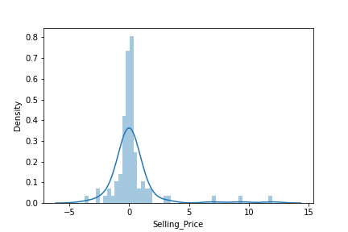

o	The scatterplot shows a linear distribution which ensures the accuracy of this model so we can finally say that prediction of the selling price using
available dataset is accurate.

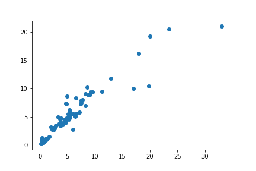

Create & dump the pickle file:

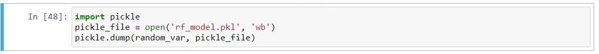

#	Building Web Application 

Now that our machine learning pipeline and model are ready we will start building a web application that can connect to them and generate predictions on
new data in real-time. There are two parts of this application:

•	Front-end (designed using HTML & CSS )

•	Back-end (developed using Flask in Python 3.9)

Front-end of Web Application

•	Index.html 

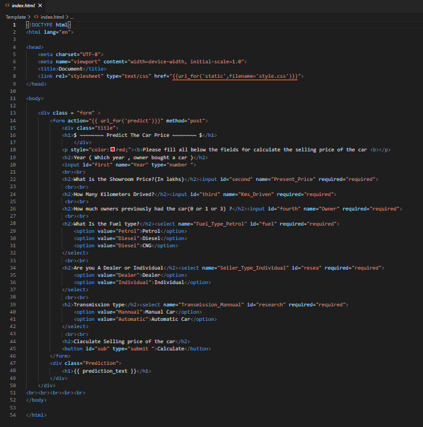

•	Style.css 

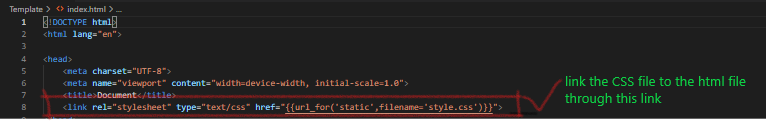

Back-end of Web Application 

The back-end of a web application is developed using a Flask framework. 

Testing App

One final step before publish the application on Heroku is to test the web app locally. Open terminal navigate to folder where ‘app.py’ is saved on. Run
the python file with below code:

>python app.py

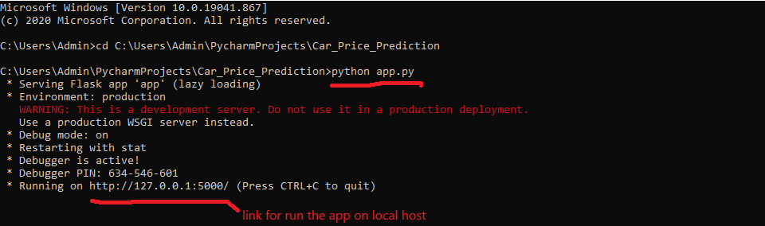

Output in terminal when app.py is executed

copy the URL into a browser and it should open a web application hosted on local machine (127.0.0.1).

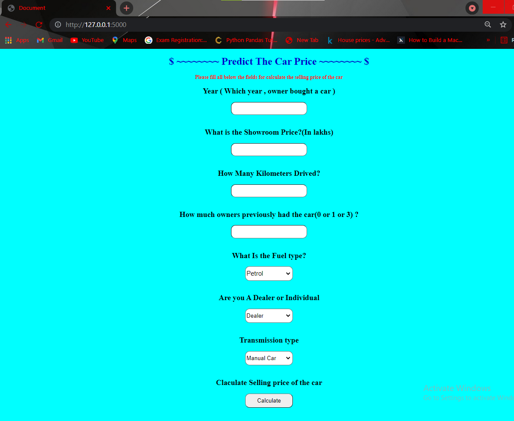

Web application opened on local machine

#	Deploy the Web App on Heroku 

•	Now that the model is trained, the machine learning pipeline is ready, and the application is tested on local machine, Ml model is ready for deployment.

•	For model deployment process, two more files are necessary, Reqirement.txt & Procfile

Requirment.txt: requirements.txt file is a text file containing the names of the python packages required to execute the application. If these packages are
not installed in the environment application is running, it will fail.

pip freeze > requirements.txt (this command is used to create the requirement.txt file)

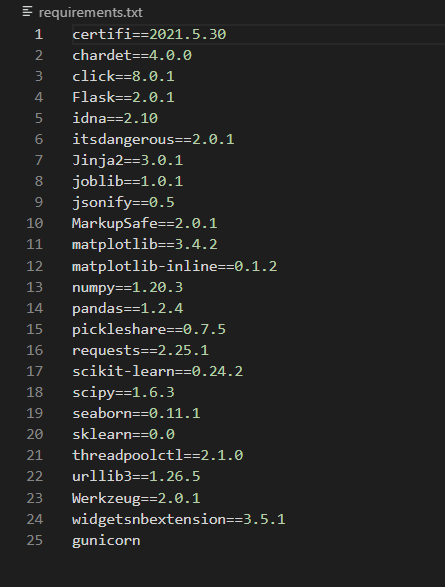

Procfile: Procfile is simply one line of code that provides startup instructions to web server that indicate which file should be executed first when somebody logs into the application. 

In this example the name of our application file is ‘app.py’ and the name of the application is also ‘app’. (hence app:app)

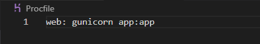  

Step 1 — Sign up on heroku.com and Log in

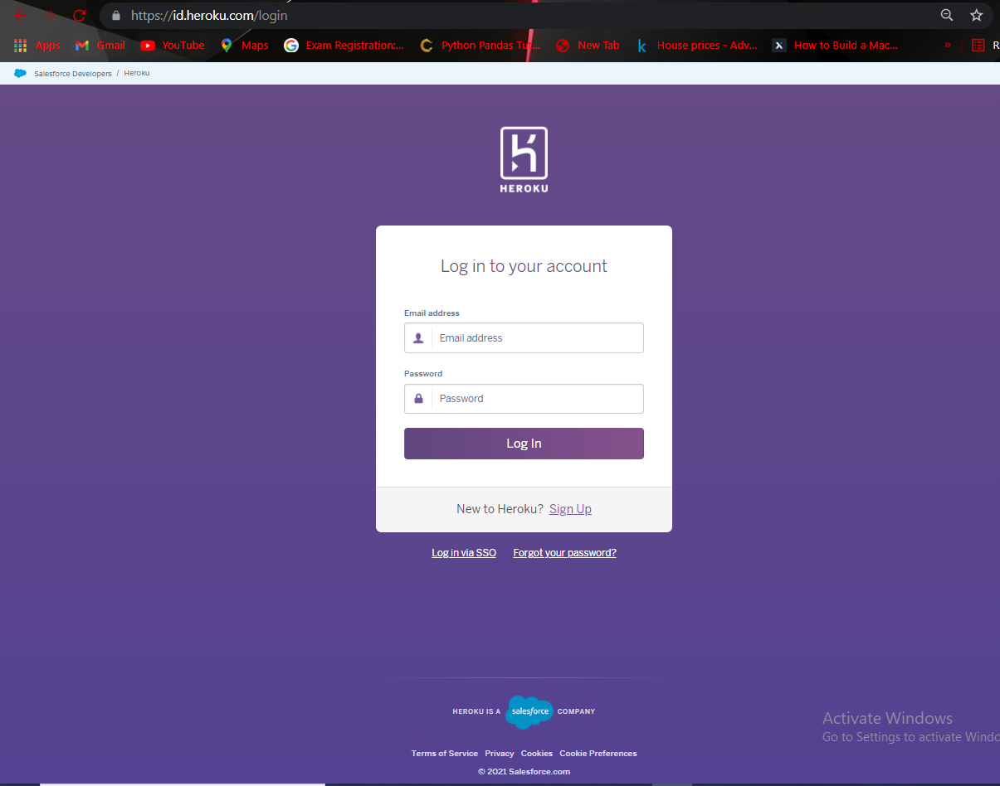

Step 2 – After log in click on the new button

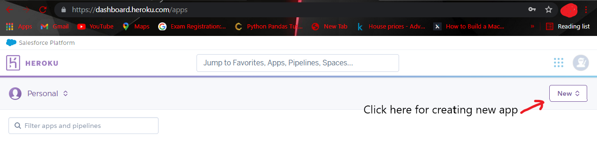

Step 3 - Create new app

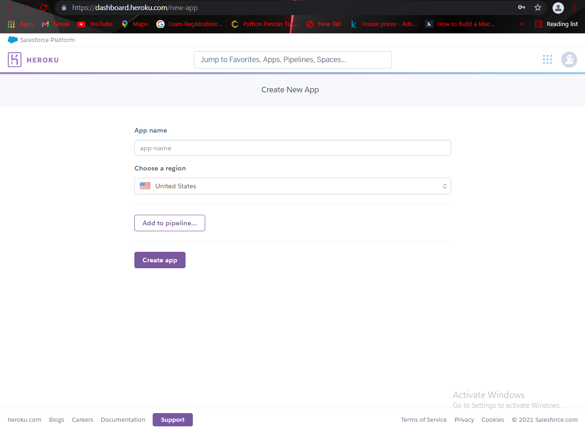

Step 4 - Click on Deploy & Connect to your GitHub repository where code is hosted.

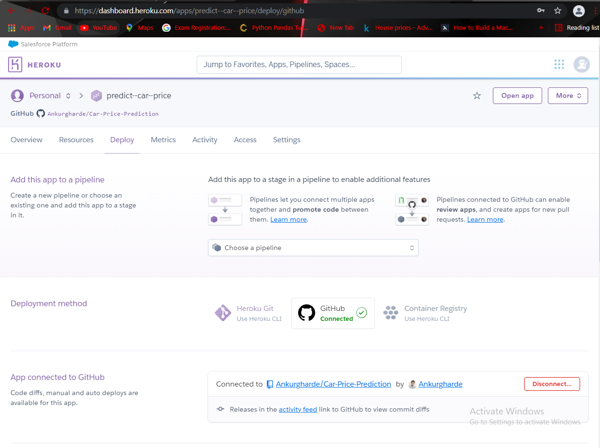

Step 5 – Deploy branch

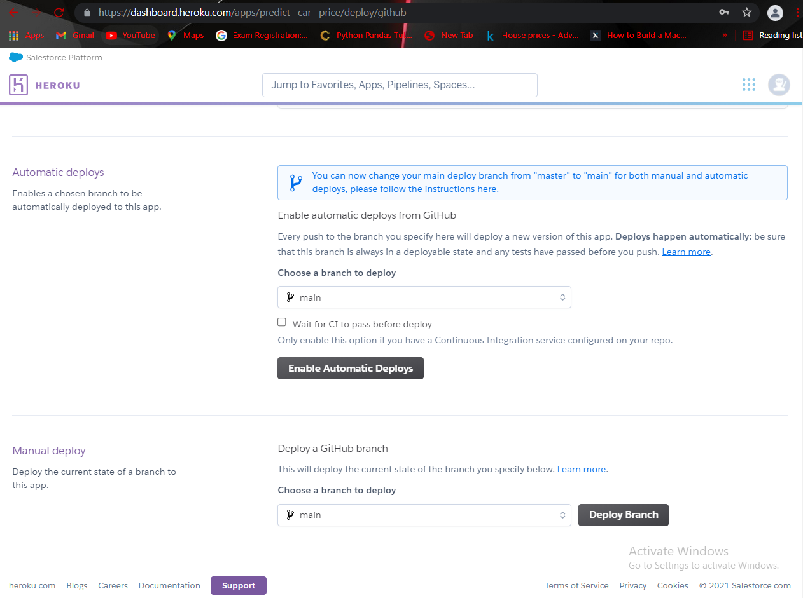

Step 6 – Wait for Few Minutes, after that app is deployed successfully

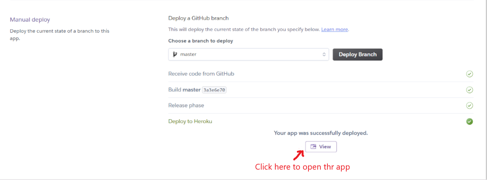

Step 7 – Check the app works properly or not

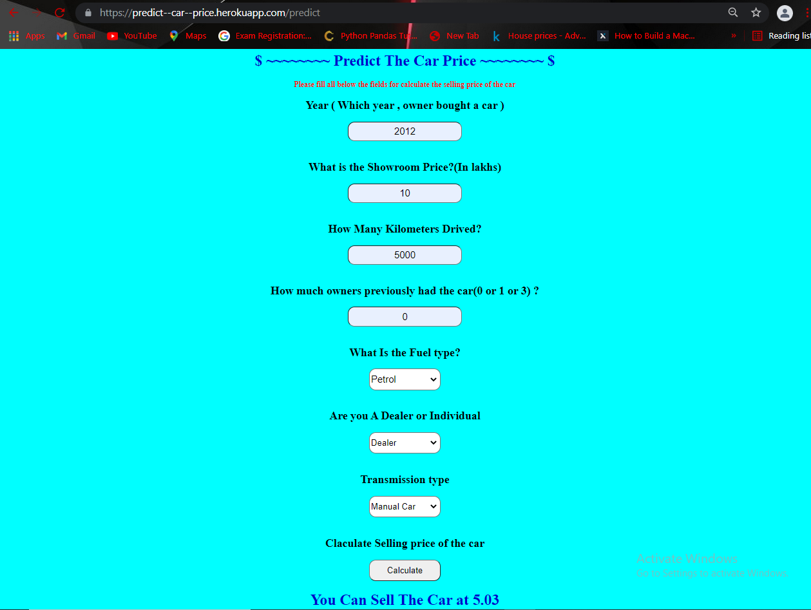

This app worked properly, app is successfully deployed on Heroku.
Check app here : https://predict--car--price.herokuapp.com/

